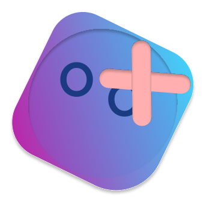

<div align="center">

  
  <h1>Uzyi</h1>
  <p>A custom virtual machine and instruction set architecture (ISA) developed in Rust, featuring a Kotlin-based assembler.</p>

  <p>
    <a href="https://crates.io/crates/uzyi"></a>
    <a href="https://rust-lang.org"></a>
    <a href="LICENSE"></a>
  </p>
</div>

Uzyi is a small, unopinionated virtual machine you can embed into your Rust or Java/Kotlin apps via JNI. It provides:

- **Custom ISA**: A simple and extensible instruction set.
- **Virtual Machine**: Efficient execution of bytecode with a stack and registers.
- **JNI Integration**: Seamlessly call the VM from Java/Kotlin environments.
- **Kotlin Assembler**: A DSL-based assembler for writing Uzyi bytecode easily.

Quick links

- Security policy: [SECURITY.md](SECURITY.md)
- Contributing guide: [CONTRIBUTING.md](CONTRIBUTING.md)
- Code of Conduct: [CODE_OF_CONDUCT.md](CODE_OF_CONDUCT.md)
- Support: [SUPPORT.md](SUPPORT.md)
- License: MIT ([LICENSE](LICENSE))
- Repository: [GitHub](https://github.com/Jadiefication/Uzyi)

## About the Project

Uzyi is a custom-built 8-bit virtual machine (VM) and instruction set architecture (ISA) designed for educational purposes and embedding in high-level applications. It features a core written in Rust for performance and safety, and a versatile assembler written in Kotlin for developer productivity.

### Why Uzyi?
- **Hybrid Architecture:** Combines the low-level efficiency of Rust with the high-level expressiveness of Kotlin.
- **Cross-Platform:** Bundles native binaries for Linux, Windows, and macOS, allowing it to run anywhere a JVM is available.
- **Embedded by Design:** Small footprint makes it ideal for embedding as a scripting or specialized execution engine within larger applications.

### Limitations
Uzyi is currently a research and hobbyist artifact and has the following limitations:
- **8-bit Integers:** General-purpose registers and memory cells handle 8-bit signed/unsigned values (-128 to 127).
- **Small Memory Space:** 256 bytes of total memory.
- **Limited Register File:** 8 general-purpose registers (R0-R7), with R7 serving as the stack pointer.
- **No Floating Point:** Arithmetic is limited to integer operations.
- **Non-Standard Bytecode:** The ISA is custom and not compatible with any existing hardware.

## Demo & Real-World Proof

A traditional "Demo URL" (like a hosted website) is not feasible for Uzyi because:
1. It relies on **JNI (Java Native Interface)**, which requires native libraries (.so, .dll, .dylib) to be loaded by the operating system.
2. The core logic is executed in a compiled Rust environment, not a browser-native environment like WebAssembly (though that is a potential future direction).

To see Uzyi in action, you can:
- **Check the CI/CD Pipeline:** Our [JitPack integration](https://jitpack.io/#Jadiefication/Uzyi) proves the project builds and bundles for multiple operating systems.
- **Run the Tests:** The comprehensive test suite in `web/src/test/kotlin/io/jadie/VMTest.kt` acts as a living demonstration of every instruction and VM capability.
- **Look at the Code:** The `web` module demonstrates how to use the Kotlin DSL to generate and execute bytecode on the fly.

## Getting Started

If you want to run Uzyi locally and experiment with the ISA:

### Prerequisites
- [Rust 1.80+](https://rustup.rs/)
- [JDK 17+](https://adoptium.net/)
- [Gradle](https://gradle.org/install/) (optional, uses wrapper)

### Local Setup & Build

1. **Clone the repository:**
   ```bash
   git clone https://github.com/Jadiefication/Uzyi.git
   cd Uzyi
   ```

2. **Build the native library:**
   ```bash
   cargo build --release
   ```

3. **Run the Kotlin environment:**
   Move to the `web` directory and run the tests to verify everything is linked correctly.
   ```bash
   cd web
   ./gradlew test
   ```

4. **Using it in your own project:**
   You can add Uzyi as a dependency via JitPack. Add this to your `build.gradle.kts`:
   ```kotlin
   repositories {
       maven { url = uri("https://jitpack.io") }
   }
   dependencies {
       implementation("com.github.Jadiefication:Uzyi:Tag")
   }
   ```

## ISA Overview

The Uzyi ISA includes 32+ instructions covering:
- **Data Movement:** `mov`, `movr`, `push`, `pop`
- **Arithmetic:** `add`, `sub`, `mul`, `div`, `inc`, `dec`, `addi`, `subi`, `muli`
- **Logical:** `and`, `or`, `xor`, `not`, `shl`, `shr`
- **Control Flow:** `cmp`, `beq`, `blo`, `bhi`, `bleq`, `bheq`, `b`, `call`, `ret`
- **Memory:** `load`, `store`, `loadr`, `storer`
- **System:** `hlt`, `sleep`

### Register File
- **R0 - R6:** General-purpose 8-bit registers.
- **R7:** Stack Pointer (SP). Initialized to 255 (top of memory).

### Memory Map
- **0x00 - 0xFB:** General-purpose RAM (Instructions are loaded starting at 0x00).
- **0xFC:** Cycle counter (Read-only).
- **0xFD:** Execution timer (Read-only).
- **0xFE - 0xFF:** Reserved.

## Commands & Scripts

The project uses Cargo and Gradle for common tasks:

- `cargo build`: Build the Rust VM.
- `cargo test`: Run Rust tests.
- `./gradlew build`: Build the Kotlin assembler (in `web/` directory).
- `cargo fmt`: Format the codebase.

## Principles

#### Unopinionated
Uzyi doesn’t force a particular architecture. It provides a simple VM core that can be adapted to various needs.

#### Performance
Leverages Rust's performance and safety to provide a reliable execution environment.

#### Testable
Every instruction and VM state transition is designed to be testable, ensuring correctness of the ISA implementation.

## Documentation

Core entry points:

- `uzyi::vm::VM` — The main virtual machine state.
- `uzyi::instructions::Instruction` — ISA definitions.
- `io.jadie.asm.Asm` — Kotlin Assembler DSL.

## Testing

The test suite is authoritative and aims for high coverage.
- Run Rust tests: `cargo test`
- Run Kotlin tests: `./gradlew test`

## Contributing

We welcome contributions! Please see [CONTRIBUTING.md](CONTRIBUTING.md) and [CODE_OF_CONDUCT.md](CODE_OF_CONDUCT.md).

## License

[MIT](LICENSE) — © 2025 Jadiefication
